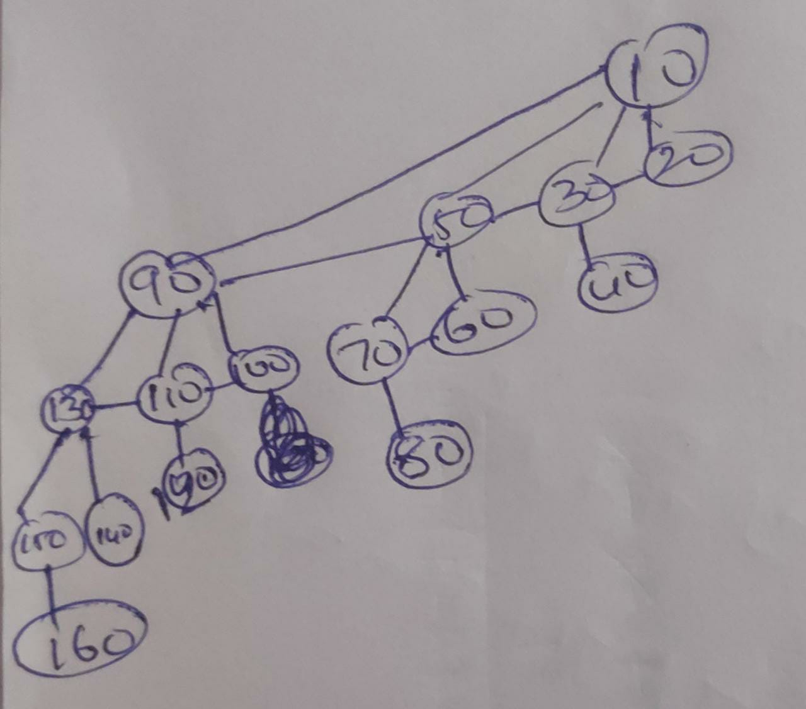
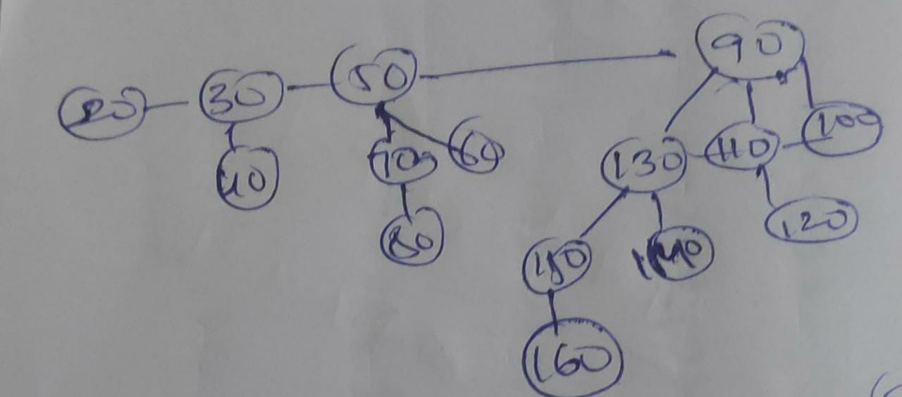
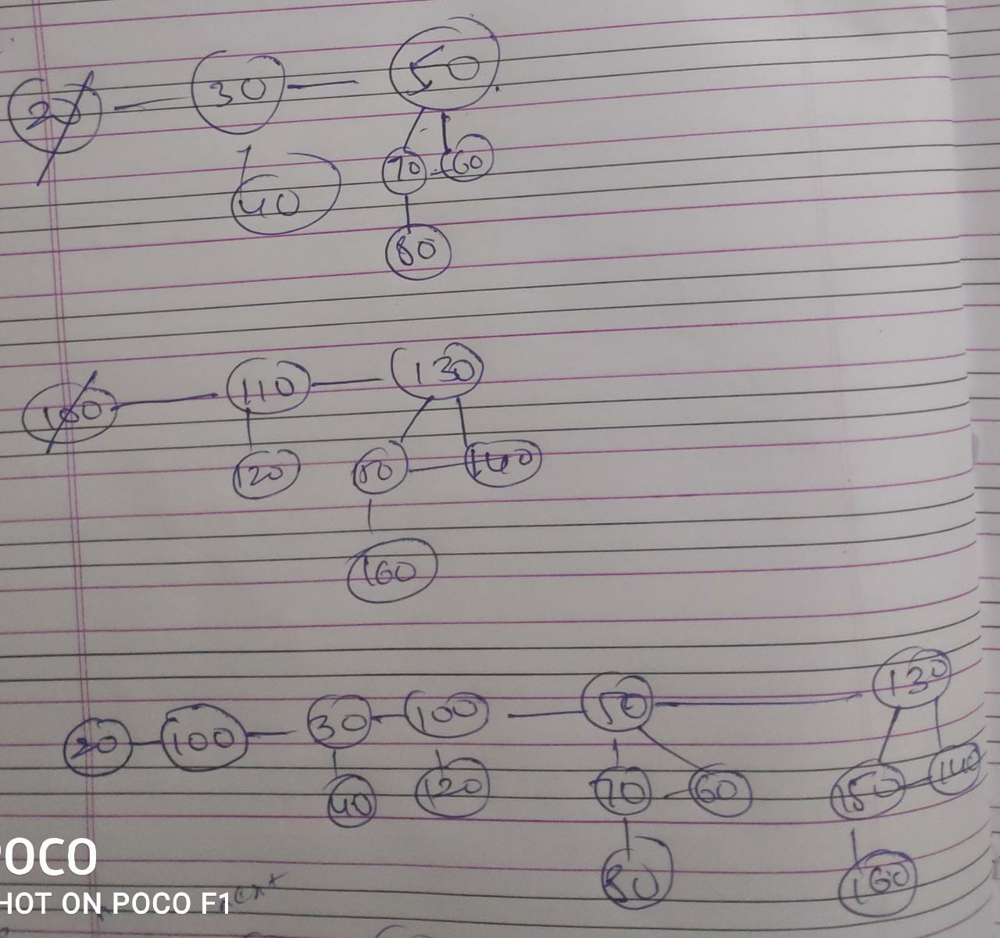
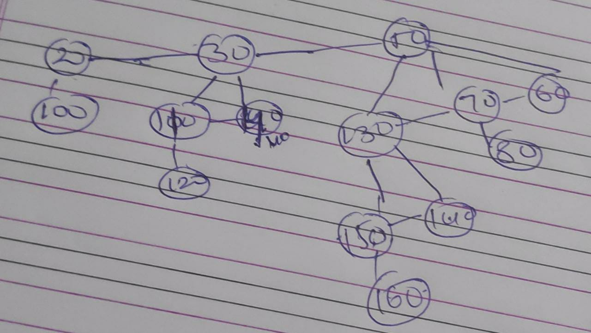
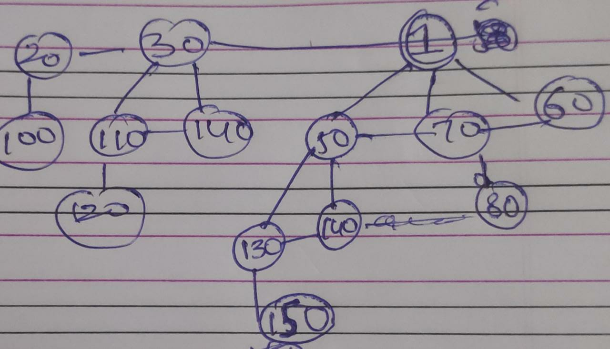

# Checking Input with Explanation

## INPUT:
    - i 10
    - i 20
    - i 30
    - i 40
    - i 50
    - i 60
    - i 70
    - i 80
    - i 90
    - i 100
    - i 110
    - i 120
    - i 130
    - i 140
    - i 150
    - i 160   (step 1)
    - p
    - x       (step 2)
    - p
    - d 90    (step 3)
    - p
    - d 90
    - d 90 10
    - m
    - x
    - p
    - i 20
    - p
    - r 160 1 (step 4)
    - p
    - e

## OUTPUT:
    - 10 90 50 30 20 130 110 100 70 60 40 150 140 120 80 160
    - 10
    - 20 30 40 50 70 60 80 90 130 110 100 150 140 120 160
    - 90
    - 20 100 30 110 40 120 50 130 70 60 150 140 80 160
    - -1
    - -1
    - 20
    - 20
    - 100 30 110 40 120 50 130 70 60 150 140 80 160
    - 20 100 30 110 40 120 1 50 70 60 130 140 80 150
    - 1
    - 20 100 30 110 40 120 50 130 70 60 150 140 80 160

- After Inserting elements from 10 to 160 Heap be like (step 1)
   - 

- After Extracting Min (step 2)
   - 

- After Deleting 90 (step 3)
   - 
   - Then
   - 
- Ater Decreasing 160 to 1 (step 4)
   - 
